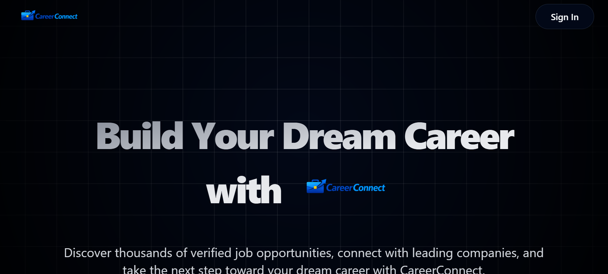

# 🚀 CareerConnect – Full Stack Job Portal

CareerConnect is a modern Full Stack Job Portal that connects job seekers with recruiters. It allows users to search and apply for jobs while enabling recruiters to post and manage job listings through a clean, secure, and responsive platform.

---

## 🌐 Live Demo

👉 **Live Website:** https://careerconnect-mu-amber.vercel.app

---

## 📸 Project Preview



---

## ✨ Features

### 👨‍💼 Job Seekers
- 🔐 Secure Authentication with Clerk
- 🔍 Search and Filter Jobs
- ❤️ Save Favorite Jobs
- 📄 Apply for Jobs
- 📋 Track Applied Jobs
- 📱 Fully Responsive Design

### 🏢 Recruiters
- 🏢 Company Registration
- ➕ Post New Jobs
- ✏️ Manage Job Listings
- 👥 View Applicants
- 📊 Recruiter Dashboard

### 🌟 General Features
- ⚡ Fast Performance
- 🎨 Modern UI with Tailwind CSS
- 🔒 Protected Routes
- ☁️ Supabase Database Integration
- 📱 Mobile Friendly

---

## 🛠️ Tech Stack

### Frontend
- React.js
- Vite
- JavaScript
- Tailwind CSS
- Shadcn UI

### Backend & Services
- Supabase
- Clerk Authentication

### Deployment
- Vercel

---

## 📂 Folder Structure

```text
careerconnect/
│
├── images/
│   └── preview.png
│
├── public/
│
├── src/
│   ├── api/
│   ├── components/
│   ├── hooks/
│   ├── pages/
│   ├── utils/
│   ├── App.jsx
│   └── main.jsx
│
├── .env
├── package.json
├── vite.config.js
└── README.md
```

---

## ⚙️ Installation

### Clone the Repository

```bash
git clone https://github.com/Akanksha-Sengar03/careerconnect.git
```

### Navigate to Project

```bash
cd careerconnect
```

### Install Dependencies

```bash
npm install
```

### Run Development Server

```bash
npm run dev
```

Open:

```text
http://localhost:5173
```

---

## 🔐 Environment Variables

Create a `.env` file in the root directory and add:

```env
VITE_SUPABASE_URL=YOUR_SUPABASE_URL
VITE_SUPABASE_ANON_KEY=YOUR_SUPABASE_ANON_KEY
VITE_CLERK_PUBLISHABLE_KEY=YOUR_CLERK_PUBLISHABLE_KEY
```

---

## 📱 Application Modules

- 🏠 Landing Page
- 🔍 Job Search
- 📄 Job Details
- ❤️ Saved Jobs
- 📝 Apply for Jobs
- 🏢 Recruiter Dashboard
- ➕ Post New Jobs
- 👤 User Authentication

---

## 🚀 Future Enhancements

- Resume Upload
- Email Notifications
- AI Job Recommendations
- Chat Between Recruiters & Candidates
- Interview Scheduling
- Admin Dashboard
- Dark Mode

---

## 📚 Learning Outcomes

This project helped me learn:

- React.js Fundamentals
- React Router
- Tailwind CSS
- Clerk Authentication
- Supabase Integration
- CRUD Operations
- Protected Routes
- Responsive UI Design
- Git & GitHub Workflow
- Vercel Deployment

---

## 👩‍💻 Author

**Akanksha Sengar**

📧 GitHub: https://github.com/Akanksha-Sengar03

💻 Repository: https://github.com/Akanksha-Sengar03/careerconnect

🌐 Live Demo: https://careerconnect-mu-amber.vercel.app

---

## ⭐ Show Your Support

If you found this project useful, please consider giving it a ⭐ on GitHub.
